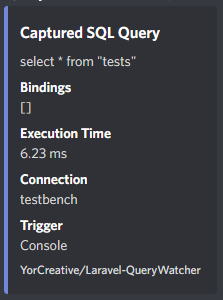
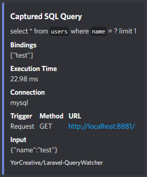

<br />
<br />

<div align="center">
  <a href="https://github.com/YorCreative">
    
  </a>
</div>

<h3 align="center">Laravel Query Watcher</h3>

<br />


A Laravel package that provides configurable application query capturing & monitoring.

## Installation

install the package via composer:

```bash
composer require YorCreative/Laravel-Query-Watcher
```

Publish the packages assets.

```bash
php artisan vendor:publish --provider="YorCreative\QueryWatcher\QueryWatcherServiceProvider"
```

## Usage

### Configuration

Adjust the configuration file to suite your application.

```php
[
    'enabled' => true, // Do you want to capture queries?
    'token' => env('QUERY_WATCH_TOKEN', 'change_me'), // Token used for Authenticating Private Broadcast Channel
    'scope' => [
        'time_exceeds_ms' => [
            'enabled' => true, // Do you want to capture everything or only slow queries?
            'threshold' => 500, // The number of milliseconds it took to execute the query.
        ],
    ],
    'listener' => [ // Channel notifications are queued
        'connection' => 'sync', // Define what connection to use.
        'queue' => 'default', //  Define what queue to use
        'delay' => null, // Do you want to delay the notifications at all?
    ],
    'channels' => [ // Where to send notifications?
        'discord' => [ 
            'enabled' => false, // Do you want discord webhook notifications?
            'hook' => env('DISCORD_HOOK', 'please_fill_me_in'), 
        ],
    ]
]
```

### Broadcasting

All captured queries will broadcast on a private channel as the primary monitoring method. The QueryEvent that is
broadcasting is using your
applications [broadcast configuration](https://laravel.com/docs/9.x/broadcasting#configuration).

```php
    /**
     * Get the channels the event should broadcast on.
     *
     * @return PrivateChannel
     */
    public function broadcastOn(): PrivateChannel
    {
        return new PrivateChannel('query.event.'. config('querywatcher.token'));
    }

    /**
     * @return string
     */
    public function broadcastAs(): string
    {
        return 'query.event';
    }
```

### Discord Notification Channel

Get a webhook URL from discord in the channel you want to receive your notifications in by
reading [Discords Introduction to Webhook Article](https://support.discord.com/hc/en-us/articles/228383668-Intro-to-Webhooks)
. Once you have your webhook url, add the following variable to your `.env` file.

```dotenv
DISCORD_HOOK=<hook>
```

Once you have done this, you can enable Discord Notifications in the configuration file.

### Screenshots

<div align="center">
  <a href="https://github.com/YorCreative">
    
  </a>
</div>
<br>
<div align="center">
  <a href="https://github.com/YorCreative">
    
  </a>
</div>

## Testing

```bash
composer test
```

## Credits

- [Yorda](https://github.com/yordadev)
- [All Contributors](../../contributors)

